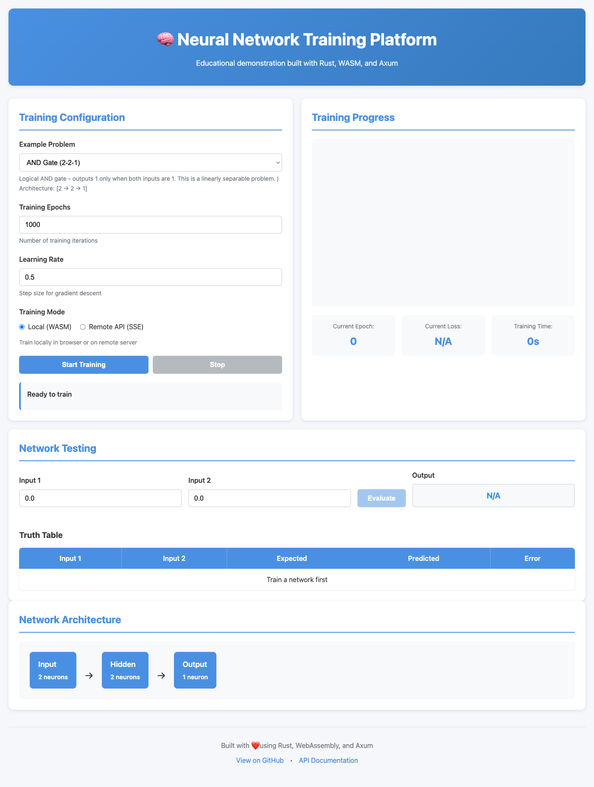
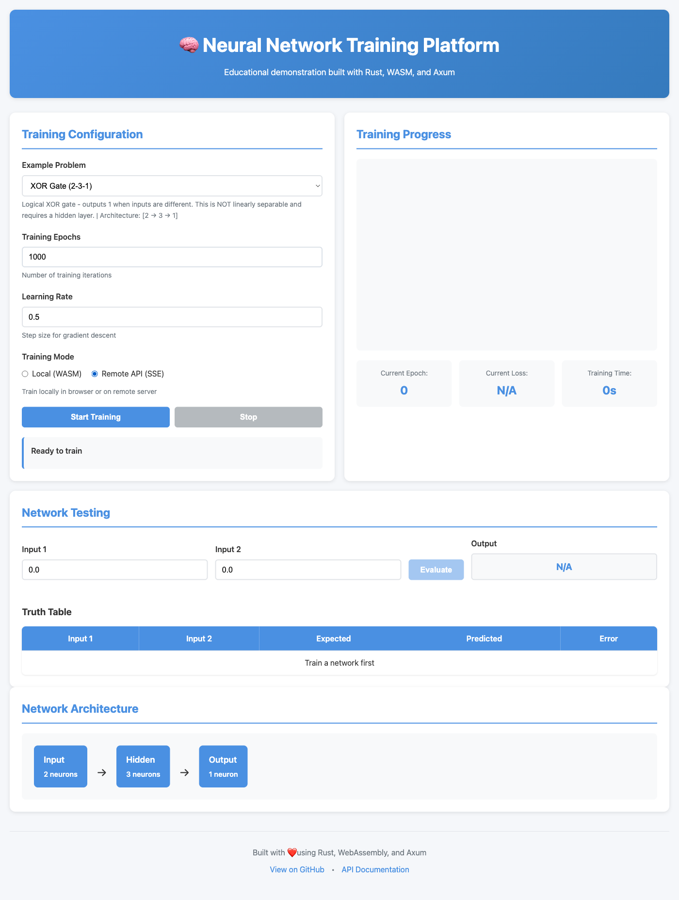
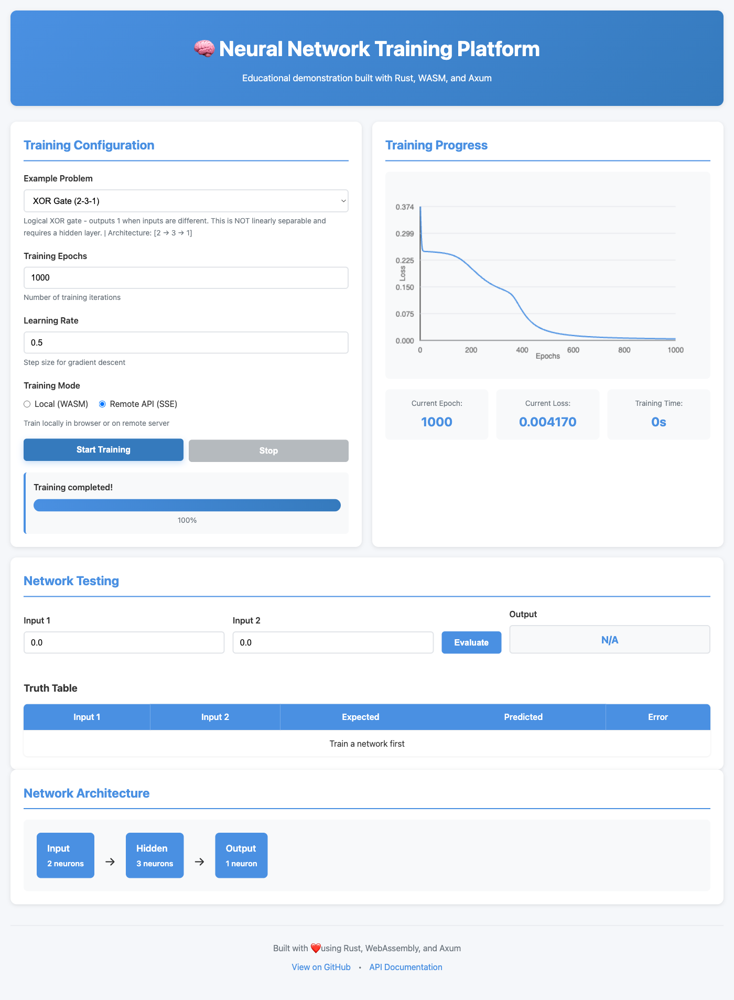
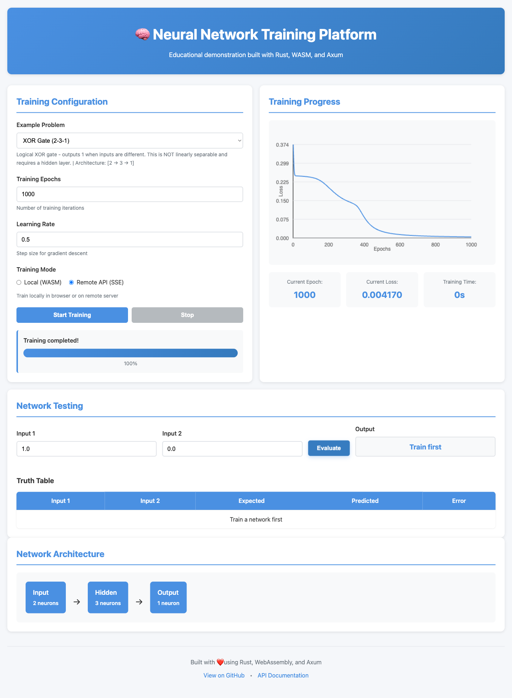
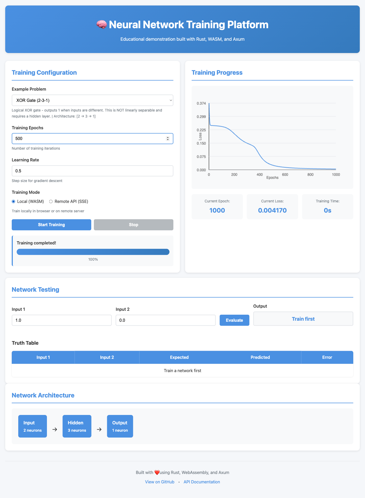
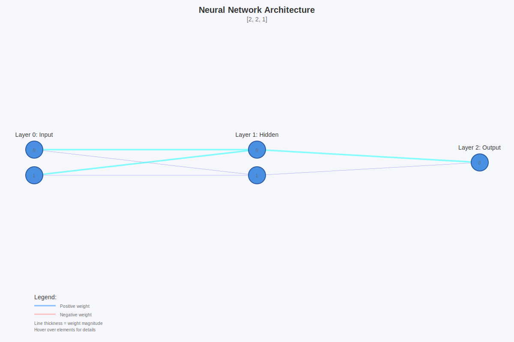
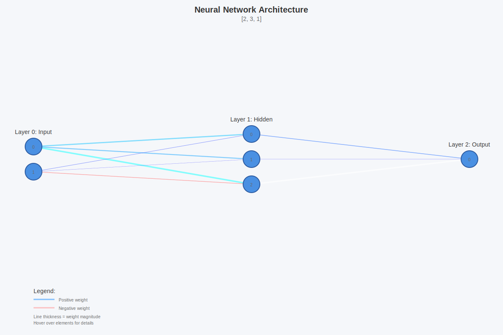
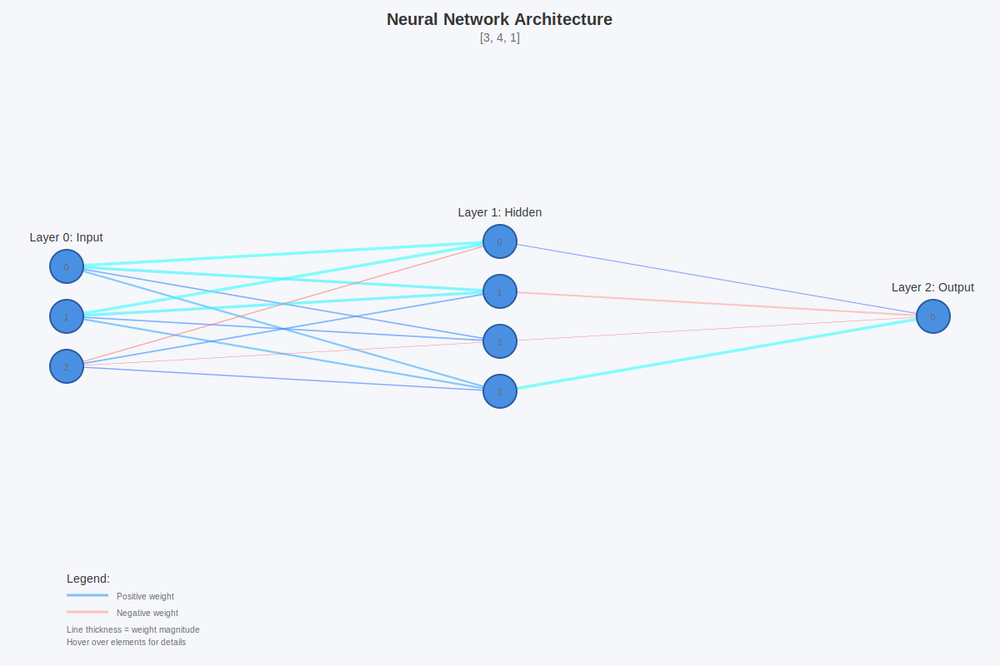
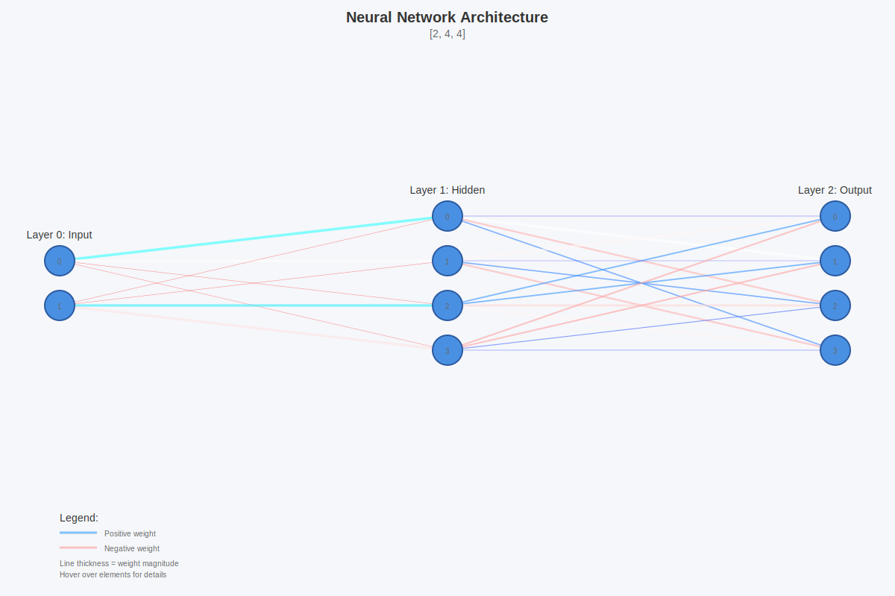

# Neural Network Demonstration Platform

A comprehensive educational neural network framework implemented in Rust, featuring a full-featured CLI, REST API web server with real-time training progress streaming, WebAssembly compilation for browser-based training, interactive web UI, checkpoint/resume functionality, and visual training progress bars.

## Overview

This project demonstrates fundamental neural network concepts through a clean, well-tested Rust implementation. It includes everything needed to train, evaluate, and experiment with neural networks on classic logic gate problems (AND, OR, XOR), with CLI, web server, and browser-based WASM interfaces.

## Features

- **Feed-forward Neural Networks**: Configurable architecture with backpropagation training
- **Interactive CLI**: Full-featured command-line interface for training and evaluation
- **REST API Server**: Axum-based web server with JSON API endpoints
- **Real-time Training Streaming**: Server-Sent Events (SSE) for live training progress
- **WebAssembly Compilation**: Run neural networks directly in the browser
- **Interactive Web UI**: Modern, responsive interface with dual-mode training (WASM/API)
- **Checkpoint System**: Save and resume training at any point
- **Visual Progress Bars**: Real-time training progress with ETA and loss metrics
- **Training Controller**: Advanced training orchestration with callback support
- **Example Problems**: Built-in AND, OR, and XOR logic gate training examples
- **Comprehensive Testing**: 136+ tests with 100% passing rate
- **Zero Clippy Warnings**: Clean, idiomatic Rust code throughout

## Quick Start

### Installation

```bash
# Clone the repository
git clone <repository-url>
cd neural-net-rs

# Build the project
cargo build --release

# Run the CLI
cargo run --bin neural-net-cli -- --help
```

### Training a Network

```bash
# Train an XOR network with visual progress bar
cargo run --bin neural-net-cli -- train --example xor --epochs 10000

# Save the trained model
cargo run --bin neural-net-cli -- train --example xor --epochs 10000 --output checkpoints/xor_model.json

# Customize learning rate
cargo run --bin neural-net-cli -- train --example and --epochs 5000 --learning-rate 0.3 --output checkpoints/and_model.json
```

### Evaluating a Trained Model

```bash
# Load and evaluate a trained model
cargo run --bin neural-net-cli -- eval --model checkpoints/xor_model.json --input 1.0,0.0

# View model information
cargo run --bin neural-net-cli -- info --model checkpoints/xor_model.json
```

### Resuming Training

```bash
# Resume training from a checkpoint
cargo run --bin neural-net-cli -- resume --checkpoint checkpoints/xor_model.json --epochs 5000 --output checkpoints/xor_continued.json
```

## Project Structure

This is a Cargo workspace with multiple crates:

```
neural-net-rs/
├── matrix/                 # Core linear algebra library
├── neural-network/         # Neural network implementation
│   ├── src/
│   │   ├── network.rs     # Network architecture
│   │   ├── activations.rs # Activation functions
│   │   ├── checkpoint.rs  # Save/load functionality
│   │   ├── training.rs    # Training controller
│   │   └── examples.rs    # Built-in examples
│   └── tests/             # Integration tests
├── neural-net-cli/         # Command-line interface
│   ├── src/main.rs        # CLI implementation
│   └── tests/             # CLI integration tests
├── neural-net-server/      # REST API web server
│   ├── src/
│   │   ├── lib.rs         # Server implementation
│   │   └── main.rs        # Server entry point
│   ├── static/            # Web UI assets
│   │   ├── index.html     # Main UI
│   │   ├── app.js         # Application logic
│   │   ├── styles.css     # Styling
│   │   └── wasm/          # WASM module
│   └── tests/             # Server integration tests
├── neural-net-wasm/        # WebAssembly bindings
│   ├── src/lib.rs         # WASM API implementation
│   └── pkg/               # Built WASM package (gitignored)
└── consumer_binary/        # Example usage binary
```

## CLI Commands

### `list` - List Available Examples

```bash
cargo run --bin neural-net-cli -- list
```

Shows all built-in training examples with descriptions.

### `train` - Train a New Network

```bash
cargo run --bin neural-net-cli -- train [OPTIONS]

Options:
  -e, --example <EXAMPLE>          Example to train on (and, or, xor)
  -n, --epochs <EPOCHS>            Number of training epochs [default: 10000]
  -l, --learning-rate <RATE>       Learning rate [default: 0.5]
  -o, --output <FILE>              Output file path for trained model
```

Features:
- Visual progress bar with ETA
- Real-time loss tracking
- Automatic checkpoint saving

### `resume` - Resume Training from Checkpoint

```bash
cargo run --bin neural-net-cli -- resume [OPTIONS]

Options:
  -c, --checkpoint <FILE>          Path to checkpoint file
  -n, --epochs <EPOCHS>            Number of additional training epochs
  -o, --output <FILE>              Output file path for updated model
```

### `eval` - Evaluate a Trained Model

```bash
cargo run --bin neural-net-cli -- eval [OPTIONS]

Options:
  -m, --model <FILE>               Path to trained model file
  -i, --input <VALUES>             Input values (comma-separated)
```

Example:
```bash
cargo run --bin neural-net-cli -- eval --model checkpoints/xor_model.json --input 1.0,0.0
```

### `info` - Display Model Information

```bash
cargo run --bin neural-net-cli -- info [OPTIONS]

Options:
  -m, --model <FILE>               Path to model file
```

Displays:
- Model metadata (version, example, epochs, learning rate, timestamp)
- Network architecture (layers, neurons)
- Weight matrix dimensions
- Bias vector dimensions
- Total parameter count

## Web Server

The neural-net-server provides a REST API for training and evaluating neural networks remotely.

### Starting the Server

```bash
# Start the server on default port 3000 (localhost only)
cargo run --bin neural-net-server

# Specify custom port
cargo run --bin neural-net-server -- --port 8080

# Bind to all interfaces (0.0.0.0) for network access
cargo run --bin neural-net-server -- --host 0.0.0.0 --port 8080

# Show help
cargo run --bin neural-net-server -- --help
```

**CLI Options:**
- `-H, --host <HOST>`: Host address to bind to (default: `127.0.0.1`)
  - Use `127.0.0.1` for localhost only
  - Use `0.0.0.0` to allow external connections
- `-p, --port <PORT>`: Port number to listen on (default: `3000`)
- `-h, --help`: Print help information
- `-V, --version`: Print version

The server provides:
- REST API endpoints at `/api/*`
- Interactive web UI at `/`
- Static file serving from `./static/` directory
- CORS support for cross-origin requests

### API Endpoints

#### GET `/health`
Health check endpoint.

**Response:**
```json
{
  "status": "ok"
}
```

#### GET `/api/examples`
List available training examples.

**Response:**
```json
[
  {
    "name": "and",
    "description": "Logical AND operation",
    "architecture": [2, 2, 1]
  },
  {
    "name": "xor",
    "description": "Logical XOR operation (classic non-linear problem)",
    "architecture": [2, 3, 1]
  }
]
```

#### POST `/api/train`
Train a new model (blocking, returns after training completes).

**Request:**
```json
{
  "example": "xor",
  "epochs": 10000,
  "learning_rate": 0.5
}
```

**Response:**
```json
{
  "model_id": "550e8400-e29b-41d4-a716-446655440000",
  "example": "xor",
  "epochs": 10000
}
```

#### POST `/api/train/stream`
Train a new model with real-time progress streaming via Server-Sent Events (SSE).

**Request:**
```json
{
  "example": "xor",
  "epochs": 10000,
  "learning_rate": 0.5
}
```

**Response:** SSE stream with events:
```
data: {"epoch": 100, "loss": 0.45}

data: {"epoch": 200, "loss": 0.38}

data: {"epoch": 300, "loss": 0.31}
```

The model is automatically stored after training completes.

#### POST `/api/eval`
Evaluate a trained model.

**Request:**
```json
{
  "model_id": "550e8400-e29b-41d4-a716-446655440000",
  "input": [1.0, 0.0]
}
```

**Response:**
```json
{
  "output": [0.95]
}
```

#### GET `/api/models/:id`
Get information about a trained model.

**Response:**
```json
{
  "model_id": "550e8400-e29b-41d4-a716-446655440000",
  "example": "xor",
  "architecture": [2, 3, 1],
  "epochs": 10000,
  "learning_rate": 0.5,
  "total_parameters": 13
}
```

### Example API Usage

Using `curl`:

```bash
# List examples
curl http://localhost:3000/api/examples

# Train a model (blocking)
curl -X POST http://localhost:3000/api/train \
  -H "Content-Type: application/json" \
  -d '{"example": "xor", "epochs": 10000, "learning_rate": 0.5}'

# Train with SSE streaming
curl -N http://localhost:3000/api/train/stream \
  -H "Content-Type: application/json" \
  -d '{"example": "xor", "epochs": 10000, "learning_rate": 0.5}'

# Evaluate model
curl -X POST http://localhost:3000/api/eval \
  -H "Content-Type: application/json" \
  -d '{"model_id": "YOUR-MODEL-ID", "input": [1.0, 0.0]}'

# Get model info
curl http://localhost:3000/api/models/YOUR-MODEL-ID
```

### Technical Implementation

- **Framework**: Axum 0.7 for async web server
- **Runtime**: Tokio for async operations
- **SSE Streaming**: `spawn_blocking` for CPU-bound training with `std::sync::mpsc` channels
- **State Management**: Thread-safe `Arc<Mutex<HashMap>>` for model storage
- **CORS**: Permissive CORS for development
- **Static Files**: Tower-HTTP for serving web UI assets

## Web UI

The project includes a modern, interactive web interface for training and evaluating neural networks directly in your browser.

### Features

**Dual Training Modes:**
- **Local (WASM)**: Train neural networks directly in the browser using WebAssembly
  - No server required for training
  - All computation runs client-side
  - Full neural network implementation compiled to WASM
- **Remote (API)**: Train on the server with real-time progress via Server-Sent Events
  - Live training progress updates
  - Streaming loss metrics
  - Progress visualization

**Interactive Features:**
- Real-time loss chart with Canvas visualization
- Network architecture display
- Interactive testing interface
- Truth table evaluation with error highlighting
- Training metrics (epoch, loss, elapsed time)
- Progress bar with percentage completion
- Example selection (AND, OR, XOR gates)
- Configurable training parameters (epochs, learning rate)

### Usage

```bash
# Start the web server
cargo run --bin neural-net-server

# Open your browser
open http://localhost:3000
```

The web UI will load at `http://localhost:3000` and provide:
1. **Training Configuration Panel**: Select examples, configure parameters, choose training mode
2. **Training Progress Visualization**: Real-time loss chart and metrics
3. **Network Testing**: Interactive input/output testing
4. **Architecture Display**: Visual representation of network layers

### WebAssembly Integration

All neural network logic runs in Rust/WASM:
- Network creation and initialization
- Forward propagation
- Backpropagation and training
- Gradient computation
- Weight updates

JavaScript is minimal - only for:
- WASM module bootstrapping
- DOM manipulation
- Canvas chart drawing
- SSE connection handling

**WASM Module Size**: ~248KB (optimized for size with LTO)

### Example Workflows

**Local WASM Training:**
1. Select "Local (WASM)" mode
2. Choose an example (e.g., XOR)
3. Set epochs (e.g., 1000) and learning rate (e.g., 0.5)
4. Click "Start Training"
5. Watch real-time loss chart
6. Test the network with different inputs
7. View truth table results

**Remote API Training:**
1. Select "Remote API (SSE)" mode
2. Choose an example
3. Configure parameters
4. Click "Start Training"
5. Receive live progress updates from server
6. View streaming loss metrics
7. Test the trained network

### Screenshots

The interactive web UI provides a comprehensive interface for training and evaluating neural networks:

**Initial Interface**

*Clean, modern interface with training configuration, visualization panels, and network testing*

**Remote API Training Mode**

*Select between local WASM training or remote server training with SSE streaming*

**Training in Progress**

*Real-time loss chart updates as training progresses on the server*

**Training Completed**

*Complete training history with loss curve and final metrics*

**Network Testing & Truth Table**

*Interactive testing interface with truth table showing all input combinations and prediction accuracy*

**Local WASM Mode**

*Train directly in the browser using WebAssembly - no server required for training*

## Architecture Details

### Matrix Library

The `matrix` crate provides the foundation for all neural network operations:

- **Matrix struct**: Efficient row-major storage with `Vec<f64>`
- **Operations**: Element-wise multiply, dot product, transpose, add, subtract
- **Functional programming**: Generic `map` function for transformations
- **Construction helpers**: `new()`, `zeros()`, `random()`, and `matrix!` macro
- **Well-tested**: Comprehensive test suite with edge cases

### Neural Network

The `neural-network` crate implements the core learning algorithms:

- **Configurable architecture**: Specify layer sizes as `Vec<usize>`
- **Activation functions**: Pluggable activation (currently SIGMOID)
- **Forward propagation**: Efficient matrix operations with activation caching
- **Backpropagation**: Gradient computation and weight updates
- **Serialization**: Full network state save/load with `serde`

### Checkpoint System

Robust checkpoint functionality for long-running training:

```rust
pub struct Checkpoint {
    pub metadata: CheckpointMetadata,
    pub network: Network,
}

pub struct CheckpointMetadata {
    pub version: String,
    pub example: String,
    pub epoch: u32,
    pub total_epochs: u32,
    pub learning_rate: f64,
    pub timestamp: String,
}
```

Features:
- Version checking on load
- Human-readable JSON format
- Automatic timestamp tracking
- Training continuity metadata

### Training Controller

Advanced training orchestration with callback support:

```rust
pub struct TrainingController {
    network: Network,
    config: TrainingConfig,
    callbacks: Vec<TrainingCallback>,
}
```

Features:
- **Callbacks**: Execute custom code after each epoch
- **Auto-checkpointing**: Periodic checkpoint saving
- **Progress tracking**: Loss calculation and monitoring
- **Verbose mode**: Optional detailed logging
- **Resumable training**: Load and continue from checkpoints

## Development

### Running Tests

```bash
# Run all tests
cargo test

# Run tests for specific crate
cargo test -p matrix
cargo test -p neural-network
cargo test -p neural-net-cli

# Run specific test file
cargo test --test checkpoint_tests
cargo test --test eval_tests

# Run with output
cargo test -- --nocapture
```

### Code Quality

```bash
# Run clippy (linter)
cargo clippy --all-targets --all-features

# Format code
cargo fmt

# Build documentation
cargo doc --no-deps --open
```

### Test Coverage

- **Total tests**: 136+
- **Matrix tests**: 12 unit tests
- **Neural network tests**: 62 integration tests
- **CLI tests**: 57 integration tests
- **Server tests**: 12 integration tests (2 server + 6 API + 4 SSE)
- **WASM tests**: 5 unit tests
- **Test isolation**: Uses `tempfile` crate and unique ports for parallel test safety

## Examples

### Training XOR (Classic Non-Linear Problem)

```bash
# Train XOR with 10,000 epochs
cargo run --bin neural-net-cli -- train \
  --example xor \
  --epochs 10000 \
  --learning-rate 0.5 \
  --output checkpoints/xor.json

# Evaluate all combinations
cargo run --bin neural-net-cli -- eval --model checkpoints/xor.json --input 0.0,0.0  # ~0.0
cargo run --bin neural-net-cli -- eval --model checkpoints/xor.json --input 0.0,1.0  # ~1.0
cargo run --bin neural-net-cli -- eval --model checkpoints/xor.json --input 1.0,0.0  # ~1.0
cargo run --bin neural-net-cli -- eval --model checkpoints/xor.json --input 1.0,1.0  # ~0.0
```

### Long Training with Resume

```bash
# Initial training (5000 epochs)
cargo run --bin neural-net-cli -- train \
  --example xor \
  --epochs 5000 \
  --output checkpoints/xor_partial.json

# Check progress
cargo run --bin neural-net-cli -- info --model checkpoints/xor_partial.json

# Resume for another 5000 epochs
cargo run --bin neural-net-cli -- resume \
  --checkpoint checkpoints/xor_partial.json \
  --epochs 5000 \
  --output checkpoints/xor_full.json
```

## Built-in Examples

### AND Gate

- **Architecture**: [2, 2, 1]
- **Description**: Logical AND operation
- **Difficulty**: Easy (linearly separable)

### OR Gate

- **Architecture**: [2, 2, 1]
- **Description**: Logical OR operation
- **Difficulty**: Easy (linearly separable)

### XOR Gate

- **Architecture**: [2, 3, 1]
- **Description**: Logical XOR operation (classic non-linear problem)
- **Difficulty**: Moderate (requires hidden layer)

## Network Architecture Visualizations

Visualize trained neural networks with interactive SVG diagrams showing weights, biases, and network structure.

### Generating Visualizations

```bash
# Train a network and save checkpoint
cargo run --bin neural-net-cli -- train --example xor --epochs 10000 --output checkpoints/xor_checkpoint.json

# Generate interactive SVG visualization
cargo run --bin visualize -- --checkpoint checkpoints/xor_checkpoint.json --output network.svg

# Open in browser to zoom and interact
open network.svg
```

**Options:**
- `--checkpoint <FILE>`: Path to checkpoint file (required)
- `--output <FILE>`: Output SVG file path (required)
- `--width <PIXELS>`: Canvas width (default: 1200)
- `--height <PIXELS>`: Canvas height (default: 800)
- `--show-values`: Display weight values as text on connections

### Visualization Features

- **Color-coded weights**: Blue lines = positive weights, Red lines = negative weights
- **Weight magnitude**: Line thickness represents absolute weight value
- **Interactive tooltips**: Hover over neurons to see bias values, hover over connections to see exact weights
- **Zoomable SVG**: Smooth zooming in browsers for detailed inspection
- **Network statistics**: Displays architecture, parameter count, and training metadata

### Understanding the Visualizations

Each visualization shows:
- **Neurons (circles)**: Numbered nodes arranged in layers
- **Connections (lines)**: Weighted connections between layers
- **Layer labels**: Input, Hidden, and Output layer identification
- **Legend**: Color and thickness interpretation guide

Hover over any element to see detailed information including exact weight and bias values.

### AND Gate Visualization



**Architecture**: [2, 2, 1] - **Total Parameters**: 9 (6 weights + 3 biases)

The AND gate is **linearly separable**, meaning a simple perceptron could solve it. However, this implementation uses a hidden layer for consistency. Notice how the network learns:

- **Input Layer** (2 neurons): Receives the two binary inputs (A, B)
- **Hidden Layer** (2 neurons): Creates decision boundaries
  - Hidden neurons detect when inputs are active
  - Biases adjust the activation thresholds
- **Output Layer** (1 neuron): Combines hidden layer signals
  - Strong positive weights from both hidden neurons
  - Output activates only when BOTH inputs are 1

The trained weights show clear patterns: the network learns that it needs strong activation from both inputs simultaneously to produce output 1.

### OR Gate Visualization


**Architecture**: [2, 2, 1] - **Total Parameters**: 9 (6 weights + 3 biases)

The OR gate is also **linearly separable**. The network learns a simpler decision boundary than XOR:

- **Input Layer** (2 neurons): Receives inputs A and B
- **Hidden Layer** (2 neurons): Each neuron primarily responds to one input
  - Hidden neuron 0: Strongly responds to input A
  - Hidden neuron 1: Strongly responds to input B
- **Output Layer** (1 neuron): Uses positive weights to combine signals
  - Activates when EITHER input is active
  - Output = 1 when A OR B is 1

The weight pattern reveals how the network implements logical OR: it creates parallel pathways where either input can trigger the output through its corresponding hidden neuron.

### XOR Gate Visualization



**Architecture**: [2, 3, 1] - **Total Parameters**: 13 (9 weights + 4 biases)

XOR is the classic **non-linearly separable** problem. You cannot draw a single straight line to separate the 1 cases (0,1 and 1,0) from the 0 cases (0,0 and 1,1). This is why XOR was historically important in demonstrating the need for multi-layer networks.

The network learns to decompose XOR into simpler operations:

- **Input Layer** (2 neurons): Receives inputs A and B
- **Hidden Layer** (3 neurons): Creates non-linear decision boundaries
  - **Hidden neuron 0**: Detects when input A is active (~11.8, ~8.3)
  - **Hidden neuron 1**: Detects when input B is active (~11.0, ~7.5)
  - **Hidden neuron 2**: Detects when BOTH inputs are active (~13.3, **-9.1**)
    - Note the negative weight! This is the key to XOR
    - Creates an "inhibitory" signal when both inputs are on
- **Output Layer** (1 neuron): Implements **(A OR B) AND NOT (A AND B)**
  - Positive weights from neurons 0 and 1: "Activate if A or B" (~2.9, ~2.0)
  - Strong negative weight from neuron 2: "BUT NOT if both" (**-4.68**)
  - This combination produces: Output = 1 when inputs are different

**Why only 13 parameters?** XOR is actually one of the simplest non-linear problems. The 3 hidden neurons create just enough complexity to form the required decision boundaries. This is why XOR became the canonical example for demonstrating that neural networks can learn non-linear functions - it's the minimal case that proves the concept.

**Truth Table Implementation:**
```
A | B | H0 | H1 | H2 | Output
0 | 0 | -  | -  | +  |   0      (inhibited by H2)
0 | 1 | -  | +  | -  |   1      (activated by H1)
1 | 0 | +  | -  | -  |   1      (activated by H0)
1 | 1 | +  | +  | ++ |   0      (H2 inhibits H0+H1)
```

### 3-bit Parity Visualization



**Architecture**: [3, 4, 1] - **Total Parameters**: 21 (16 weights + 5 biases)

3-bit parity is a natural extension of XOR - it outputs 1 when an **odd number** of inputs are 1. This problem scales the non-linearity from 2 inputs to 3 inputs, requiring more parameters to learn the pattern.

The network learns to count active inputs modulo 2:

- **Input Layer** (3 neurons): Receives three binary inputs (A, B, C)
- **Hidden Layer** (4 neurons): Creates complex decision boundaries to detect odd/even patterns
  - More hidden neurons needed than XOR (4 vs 3) to handle the additional input
  - Each hidden neuron learns to detect specific combinations of active inputs
  - Must distinguish between 1, 2, or 3 active inputs
- **Output Layer** (1 neuron): Combines hidden signals to implement parity function
  - Outputs 1 for odd counts: (0,0,1), (0,1,0), (1,0,0), (1,1,1)
  - Outputs 0 for even counts: (0,0,0), (0,1,1), (1,0,1), (1,1,0)

**Why 21 parameters?** With 3 inputs instead of 2, the network needs:
- 3×4 = 12 weights (input to hidden) vs 2×3 = 6 for XOR
- 4 hidden layer biases vs 3 for XOR
- 4×1 = 4 weights (hidden to output) vs 3×1 = 3 for XOR
- 1 output bias (same as XOR)

This demonstrates how parameter count scales: adding just one more input bit requires **60% more parameters** (13 → 21) to maintain the non-linear decision boundary.

**Truth Table:**
```
A | B | C | Count of 1s | Parity | Output
0 | 0 | 0 |     0       |  even  |   0
0 | 0 | 1 |     1       |  odd   |   1
0 | 1 | 0 |     1       |  odd   |   1
0 | 1 | 1 |     2       |  even  |   0
1 | 0 | 0 |     1       |  odd   |   1
1 | 0 | 1 |     2       |  even  |   0
1 | 1 | 0 |     2       |  even  |   0
1 | 1 | 1 |     3       |  odd   |   1
```

### Quadrant Classification Visualization



**Architecture**: [2, 4, 4] - **Total Parameters**: 32 (24 weights + 8 biases)

Quadrant classification is the first **multi-class output** example, introducing one-hot encoding where each output neuron represents a different class. The network classifies 2D points (x, y) into four quadrants based on the signs of their coordinates.

This demonstrates a key architectural change: **multiple output neurons** instead of a single output:

- **Input Layer** (2 neurons): Receives 2D coordinates (x, y)
- **Hidden Layer** (4 neurons): Creates decision boundaries for the four regions
  - Each hidden neuron learns to detect combinations of positive/negative coordinates
  - Hidden neuron patterns: (+x, +y), (-x, +y), (-x, -y), (+x, -y)
  - The network essentially learns two XOR-like boundaries (one for x, one for y)
- **Output Layer** (4 neurons): One neuron per quadrant (one-hot encoding)
  - Output neuron 0: Quadrant I (x > 0, y > 0)
  - Output neuron 1: Quadrant II (x < 0, y > 0)
  - Output neuron 2: Quadrant III (x < 0, y < 0)
  - Output neuron 3: Quadrant IV (x > 0, y < 0)
  - The network learns to activate exactly one output neuron for each input

**Why 32 parameters?** The parameter count comes from:
- 2×4 = 8 weights (input to hidden layer)
- 4 hidden layer biases
- 4×4 = 16 weights (hidden to output layer) - **This is the key increase**
- 4 output biases
- Total: 8 + 4 + 16 + 4 = 32 parameters

**Key Insight**: Moving from 1 output (binary classification) to 4 outputs (multi-class) increases parameters significantly. The hidden-to-output weights go from 4×1 = 4 (in XOR) to 4×4 = 16 (in quadrant), a **4× increase** in that layer alone.

**Classification Examples:**
```
Input (x, y)  | Quadrant | One-Hot Output
--------------+----------+------------------
( 1.0,  1.0)  |    I     | [1, 0, 0, 0]
(-1.0,  1.0)  |   II     | [0, 1, 0, 0]
(-1.0, -1.0)  |   III    | [0, 0, 1, 0]
( 1.0, -1.0)  |   IV     | [0, 0, 0, 1]
```

This example shows that even though the problem is **linearly separable** (you can divide the plane with two lines at x=0 and y=0), the one-hot encoding and multiple outputs create additional complexity compared to simpler binary problems.

## Technical Stack

- **Language**: Rust 2024 Edition
- **Build System**: Cargo with workspace support
- **CLI Dependencies**:
  - `serde` / `serde_json`: Serialization
  - `clap`: CLI argument parsing
  - `chrono`: Timestamp handling
  - `anyhow`: Error handling
  - `indicatif`: Progress bars
  - `tempfile`: Test isolation
- **Server Dependencies**:
  - `axum`: Web framework
  - `tokio`: Async runtime
  - `tower-http`: CORS and static file middleware
  - `uuid`: Model identification
  - `futures`: Stream utilities
  - `reqwest`: HTTP client (testing)
- **WASM Dependencies**:
  - `wasm-bindgen`: Rust/JavaScript interop
  - `serde-wasm-bindgen`: Serde support for WASM
  - `wasm-pack`: Build toolchain
  - `getrandom`: Random number generation (with js feature)
- **Web UI**:
  - Vanilla JavaScript (ES6 modules)
  - Canvas API for visualization
  - Fetch API / EventSource for server communication

## Testing Philosophy

This project follows strict Test-Driven Development (TDD):

1. **RED**: Write failing tests first
2. **GREEN**: Implement minimal code to pass
3. **REFACTOR**: Improve code quality while maintaining tests

All features are fully tested with both unit and integration tests. The test suite runs in parallel safely using the `tempfile` crate for test isolation.

## Performance Considerations

- **Matrix operations**: Optimized for small matrices (typical NN sizes)
- **Memory efficiency**: Row-major storage, minimal allocations
- **Training speed**: Suitable for small networks and datasets
- **Not production-ready**: Educational focus, not optimized for large-scale ML

## Contributing

This is an educational project demonstrating neural network concepts. When contributing:

1. Follow TDD methodology
2. Maintain 100% test pass rate
3. Keep clippy warnings at zero
4. Add tests for all new features
5. Update documentation

## License

See LICENSE file for details.

## Resources

- **Original README**: See `ORIG-README.md` for the initial project description
- **Development Guide**: See `CLAUDE.md` for development guidelines
- **Lessons Learned**: See `docs/learnings.md` for documented patterns and solutions

## Future Enhancements

Completed:
- [x] Web server with REST API (Axum) - Phase 4.1
- [x] Real-time training visualization (Server-Sent Events) - Phase 4.2
- [x] WASM compilation for browser execution - Phase 5
- [x] Interactive web UI with dual-mode training - Phase 5

Potential areas for expansion:
- [ ] Web Workers for non-blocking WASM training
- [ ] Additional activation functions (ReLU, Tanh, Softmax, etc.)
- [ ] More complex datasets (MNIST, Fashion-MNIST, etc.)
- [ ] Convolutional neural networks (CNNs)
- [ ] Recurrent neural networks (RNNs/LSTMs)
- [ ] GPU acceleration via WebGPU
- [ ] Model import/export in browser
- [ ] Network architecture visualization (graph view)
- [ ] Hyperparameter tuning interface

---

Built with ❤️ as an educational demonstration of neural networks in Rust.
